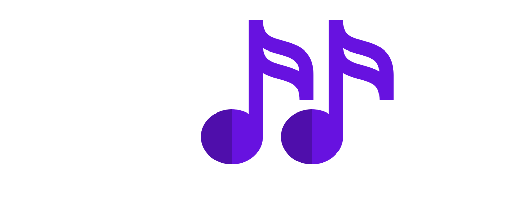

<!-- Improved compatibility of back to top link: See: https://github.com/othneildrew/Best-README-Template/pull/73 -->
<a name="readme-top"></a>
<!--
*** Thanks for checking out the Best-README-Template. If you have a suggestion
*** that would make this better, please fork the repo and create a pull request
*** or simply open an issue with the tag "enhancement".
*** Don't forget to give the project a star!
*** Thanks again! Now go create something AMAZING! :D
-->


<!-- PROJECT SHIELDS -->
<!--
*** I'm using markdown "reference style" links for readability.
*** Reference links are enclosed in brackets [ ] instead of parentheses ( ).
*** See the bottom of this document for the declaration of the reference variables
*** for contributors-url, forks-url, etc. This is an optional, concise syntax you may use.
*** https://www.markdownguide.org/basic-syntax/#reference-style-links
-->
<!-- FUTURES
[![Forks][forks-shield]][forks-url]
[![Stargazers][stars-shield]][stars-url]
[![Issues][issues-shield]][issues-url]-->


<!-- PROJECT LOGO -->
<br />
<div align="center">
  <a href="https://github.com/LaSalleGracia-Projectes/projecte-aplicaci-extra-tim-berners-lee?tab=readme-ov-file">
    
  </a>

<h3 align="center">Shuffle</h3>

  <p align="center">
    project_subtitle
    <br />
    <!-- Link to Memory PDF -->
    <a href="https://github.com/github_username/repo_name"><strong>Explore the docs »</strong></a>
    <br />
    <br />
    <!-- Link to Demo Video -->
    <a href="https://github.com/github_username/repo_name">Web App</a>
    ·
    <a href="https://github.com/github_username/repo_name/issues/new?labels=bug&template=bug-report---.md">Android App</a>
    ·
    <a href="https://github.com/github_username/repo_name/issues/new?labels=enhancement&template=feature-request---.md">Laravel DB</a>
  </p>
</div>
<!-- TABLE OF CONTENTS -->
<details>
  <summary>Table of Contents</summary>
  <ol>
    <li>
      <a href="#about-the-project">About The Project</a>
      <ul>
        <li><a href="#built-with">Built With</a></li>
      </ul>
    </li>
    <li>
      <a href="#getting-started">Getting Started</a>
      <ul>
        <li><a href="#prerequisites">Prerequisites</a></li>
        <li><a href="#installation">Installation</a></li>
        <li><a href="#deployment">Deployment</a></li>
      </ul>
    </li>
    <li><a href="#usage">Usage</a></li>
    <li><a href="#license">License</a></li>
    <li><a href="#acknowledgments">Acknowledgments</a></li>
  </ol>
</details>


<!-- ABOUT THE PROJECT -->
## About The Project

[![Product Name Screen Shot][product-screenshot]](https://example.com)

Applicacion de mobil android que utilizando spotify te permite jugar tanto en single player como multijugador, tambien con la conexion con el servidor Laravel, te permite registrar en nuestra base de usuarios para tener registro de tus partidas y ser introducido dentro de los rankings, las partidas consisten en selecionar una de las playlist disponibles o de las que el usuario tenga en spotify, despues se hara una seleccion aleatoria de canciones, configurable por el usuario, con esta seleccion creada el jugador tiene que adivinar los titulos de las canciones.

`RamonMormeneo`, `CarlaFlores`, `ShuffleApp`, `twitter_handle`, `linkedin_username`, `email_client`, `email`, `project_title`, `project_description`

<p align="right">(<a href="#readme-top">back to top</a>)</p>

## Contributors
[![Contributors]][contributors-url]

Ramon Mormeneo Ferrer - [@twitter_handle](https://twitter.com/twitter_handle) - ramonmormeneo@gmail.com


### Built With

* [![VisualStudio][Visual.com]][Visual-url]

<!-- See: https://github.com/alexandresanlim/Badges4-README.md-Profile?tab=readme-ov-file#-terminal -->

<p align="right">(<a href="#readme-top">back to top</a>)</p>


<!-- GETTING STARTED -->
## Getting Started

Para usar esta applicacion recomendamos tener un compilador y editor de codigo que funcione con c# como puede ser visual studio.

### Prerequisites

Requirements for the software and other tools to build, test and push 
- [Visual Studio](https://visualstudio.microsoft.com/es/vs/)


### Installation

1. Crear directory
   ```sh
   mkdir project-dir
   ```
2. Clonar el repo
   ```sh
   git clone https://github.com/LaSalleGracia-Projectes/projecte-aplicaci-extra-tim-berners-lee.git
   ```
### Deployment
1. Abrir CMD

2. Conseguir tu IP
   ```sh
   ipconfig
   ```
3. Aprir la solucion con el nombre ShuffleServer con un deitor de texto como Visual studio

4. Cambiar el valor de ipAddress por la Ip de tu systema

5. Ejecutar el servidor

<p align="right">(<a href="#readme-top">back to top</a>)</p>


<!-- USAGE EXAMPLES -->
## Usage

Este programa es para ser ejecutado en el background mientras la app de mobil se esta ejecutando en la misma network que el servidor para si abilitar el el modo multijugador. Se incluye dentro del repositorio un simulador de cliente para poder ver el funcionamiento de las salas, solo es possible unirse y salir de salas, con este falso cliente.

<p align="right">(<a href="#readme-top">back to top</a>)</p>


<!-- LICENSE -->
## License

[![MIT License]][license-url]

Distributed under the MIT License. See `LICENSE.txt` for more information.

<p align="right">(<a href="#readme-top">back to top</a>)</p>


<!-- ACKNOWLEDGMENTS -->
## Acknowledgments

Use this space to list resources you find helpful and would like to give credit to. 
* [Choose an Open Source License](https://choosealicense.com)
* [Img Shields](https://shields.io)
* [GitHub Pages](https://pages.github.com)
* [Font Awesome](https://fontawesome.com)

<p align="right">(<a href="#readme-top">back to top</a>)</p>


<!-- MARKDOWN LINKS & IMAGES -->
<!-- https://www.markdownguide.org/basic-syntax/#reference-style-links -->
[contributors-shield]: https://img.shields.io/github/contributors/github_username/repo_name.svg?style=for-the-badge
[license-shield]: https://img.shields.io/github/license/github_username/repo_name.svg?style=for-the-badge
[license-url]: https://github.com/LaSalleGracia-Projectes/projecte-aplicaci-extra-tim-berners-lee/LICENSE.txt
[contributors-url]: https://github.com/LaSalleGracia-Projectes/projecte-aplicaci-extra-tim-berners-lee/network/dependencies
[product-screenshot]: images/android-studio-icon.png
[Next.js]: https://img.shields.io/badge/next.js-000000?style=for-the-badge&logo=nextdotjs&logoColor=white
[Next-url]: https://nextjs.org/
[React.js]: https://img.shields.io/badge/React-20232A?style=for-the-badge&logo=react&logoColor=61DAFB
[React-url]: https://reactjs.org/
[Vue.js]: https://img.shields.io/badge/Vue.js-35495E?style=for-the-badge&logo=vuedotjs&logoColor=4FC08D
[Vue-url]: https://vuejs.org/
[Laravel.com]: https://img.shields.io/badge/Laravel-FF2D20?style=for-the-badge&logo=laravel&logoColor=white
[Laravel-url]: https://laravel.com
[Bootstrap.com]: https://img.shields.io/badge/Bootstrap-563D7C?style=for-the-badge&logo=bootstrap&logoColor=white
[Bootstrap-url]: https://getbootstrap.com
[Visual-url]: https://visualstudio.microsoft.com/es/vs/
[Visual.com]: https://img.shields.io/badge/VisualStudio-563D7C?style=for-the-badge&logo=visualstudio&logoColor=white

