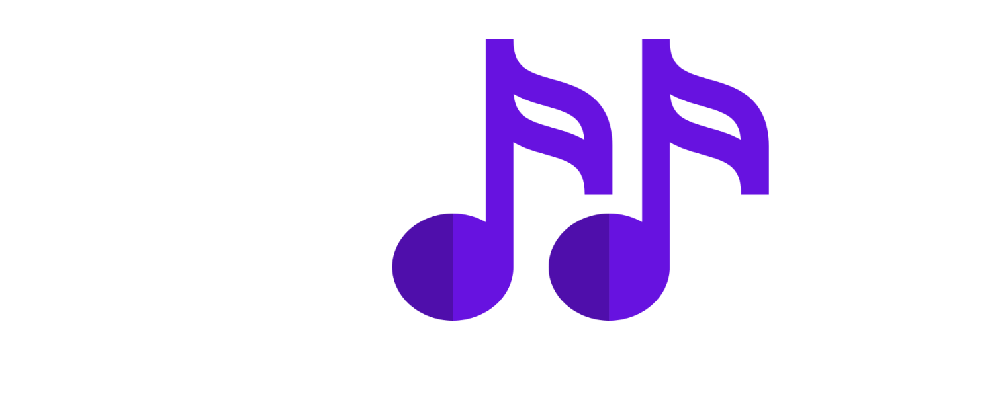

<!-- Improved compatibility of back to top link: See: https://github.com/othneildrew/Best-README-Template/pull/73 -->
<a name="readme-top"></a>
<!--
*** Thanks for checking out the Best-README-Template. If you have a suggestion
*** that would make this better, please fork the repo and create a pull request
*** or simply open an issue with the tag "enhancement".
*** Don't forget to give the project a star!
*** Thanks again! Now go create something AMAZING! :D
-->


<!-- PROJECT SHIELDS -->
<!--
*** I'm using markdown "reference style" links for readability.
*** Reference links are enclosed in brackets [ ] instead of parentheses ( ).
*** See the bottom of this document for the declaration of the reference variables
*** for contributors-url, forks-url, etc. This is an optional, concise syntax you may use.
*** https://www.markdownguide.org/basic-syntax/#reference-style-links
-->
<!-- FUTURES
[![Forks][forks-shield]][forks-url]
[![Stargazers][stars-shield]][stars-url]
[![Issues][issues-shield]][issues-url]-->


<!-- PROJECT LOGO -->
<br />
<div align="center">
  <a href="https://github.com/LaSalleGracia-Projectes/projecte-aplicaci-extra-tim-berners-lee?tab=readme-ov-file">
    
  </a>

<h3 align="center">Shuffle</h3>

  <p align="center">
    project_subtitle
    <br />
    <!-- Link to Memory PDF -->
    <a href="https://github.com/LaSalleGracia-Projectes/projecte-aplicaci-web-client-tim-berners-lee"><strong>Explorea »</strong></a>
    <br />
    <br />
    <!-- Link to Demo Video -->
    <a href="https://github.com/LaSalleGracia-Projectes/projecte-aplicaci-nativa-tim-berners-lee">Android App</a>
    ·
    <a href="https://github.com/github_username/repo_name/issues/new?labels=bug&template=bug-report---.md">Servidor C#</a>
    ·
    <a href="github.com/LaSalleGracia-Projectes/projecte-aplicaci-web-servidor-tim-berners-lee">Laravel DB</a>
  </p>
</div>
<!-- TABLE OF CONTENTS -->
<details>
  <summary>Tabla de Contentido</summary>
  <ol>
    <li>
      <a href="#about-the-project">Sobre el Proyecto</a>
      <ul>
        <li><a href="#built-with">Construido Con</a></li>
      </ul>
    </li>
    <li>
      <a href="#getting-started">Empezando</a>
      <ul>
        <li><a href="#prerequisites">Prerequisitos</a></li>
        <li><a href="#installation">Instalacion</a></li>
        <li><a href="#deployment">Despliegue</a></li>
      </ul>
    </li>
    <li><a href="#usage">Uso</a></li>
    <li><a href="#license">Licencia</a></li>
  </ol>
</details>


<!-- ABOUT THE PROJECT -->
## Sobre el Proyecto

[![Product Name Screen Shot][product-screenshot]](https://example.com)

Servidor programado en C# que permite a la applicacion web jugar con mas de un jugador. Tambien dispone de un cliente  para crear y unirse a salas y probar su funcionamiento

`RamonMormeneo`, `ShuffleServer`, `twitter_handle`, `linkedin_username`, `email_client`, `email`, `project_title`, `project_description`

<p align="right">(<a href="#readme-top">back to top</a>)</p>

## Contribuidores
[![Contributors]][contributors-url]

Pol Trujillo Albert - poltrujillo7@gmail.com

### Construido Con

* [![VisualStudio][Visual.com]][Visual-url]

<!-- See: https://github.com/alexandresanlim/Badges4-README.md-Profile?tab=readme-ov-file#-terminal -->

<p align="right">(<a href="#readme-top">back to top</a>)</p>


<!-- GETTING STARTED -->
## Empezando

Para usar esta pagina web necesitamos lo siguiente, el depurado de codigo Node.js, Spotify en el dispositvo donde vamos a usar la pagina y finalmente el servidor de Laravel de Shuffle corriendo ya sea en el mismo dispositivo o en uno del que sepamos su IP.

### Prerequisitos

- [Node](https://developer.android.com/studio)
- [Servidor Laravel](https://github.com/LaSalleGracia-Projectes/projecte-aplicaci-extra-tim-berners-lee)
- [Spotify](https://www.spotify.com/de-en/download/other/)

### Instalacion

1. Crear directory
   ```sh
   mkdir project-dir
   ```
2. Clonar el repo
   ```sh
   git clone https://github.com/LaSalleGracia-Projectes/projecte-aplicaci-web-client-tim-berners-lee
   ```
3. Tener instalado en el ordenador Node
   ```sh
   npm install
   ```

4. Instalar las dependencias usando el siguiente comando
### Despliegue
1. Asegurarse de que el servidor Laravel este en ejecucion

2. Crear un archivo llamado .env.local

3. Poner las siguientes lineas en este archivo
   ```sh
   NEXT_PUBLIC_SPOTIFY_CLIENT_ID=f46322d6b4d942c5887d10678a3e5da6
   NEXT_PUBLIC_SPOTIFY_CLIENT_SECRET=56fa3b6f044f4c0ea5c9a111550368d4
   NEXT_PUBLIC_SPOTIFY_REDIRECT_URI=http://localhost:3000/singleplayer/auth
   //La url donde se aloja el backend de laravel (127.0.0.1, si es en local)
   NEXT_PUBLIC_BACKEND_URL=http://127.0.0.1:8000
   ```

4. Cambiar la URL de NEXT_PUBLIC_BACKEND_URL si es necesario

5. Ejecutar la sigueiente comanda para empezar

  ```sh
   npm run dev
  ```

<p align="right">(<a href="#readme-top">back to top</a>)</p>


<!-- USAGE EXAMPLES -->
## Uso

Este programa ha de ser usado en conjunto a nuestro servidor Laravel, para poder registrarse y usar la applicacion, una vez dentro se puede empezar a usar la applicacion, jugando con las playlist con las que se pueden jugar, adivinar canciones y ganar puntos para llegar a lo mas alto de los rankings.

<p align="right">(<a href="#readme-top">back to top</a>)</p>


<!-- LICENSE -->
## Licencia

[![MIT License]][license-url]

Distribuido bajo la licencia MIT. Consulte `LICENSE.txt` para obtener más información.

<p align="right">(<a href="#readme-top">back to top</a>)</p>


<!-- MARKDOWN LINKS & IMAGES -->
<!-- https://www.markdownguide.org/basic-syntax/#reference-style-links -->
[contributors-shield]: https://img.shields.io/github/contributors/github_username/repo_name.svg?style=for-the-badge
[license-shield]: https://img.shields.io/github/license/github_username/repo_name.svg?style=for-the-badge
[license-url]: https://github.com/LaSalleGracia-Projectes/projecte-aplicaci-web-client-tim-berners-lee/LICENSE.txt
[contributors-url]: https://github.com/LaSalleGracia-Projectes/projecte-aplicaci-web-client-tim-berners-lee/network/dependencies
[product-screenshot]: images/android-studio-icon.png
[Next.js]: https://img.shields.io/badge/next.js-000000?style=for-the-badge&logo=nextdotjs&logoColor=white
[Next-url]: https://nextjs.org/
[React.js]: https://img.shields.io/badge/React-20232A?style=for-the-badge&logo=react&logoColor=61DAFB
[React-url]: https://reactjs.org/
[Vue.js]: https://img.shields.io/badge/Vue.js-35495E?style=for-the-badge&logo=vuedotjs&logoColor=4FC08D
[Vue-url]: https://vuejs.org/
[Laravel.com]: https://img.shields.io/badge/Laravel-FF2D20?style=for-the-badge&logo=laravel&logoColor=white
[Laravel-url]: https://laravel.com
[Bootstrap.com]: https://img.shields.io/badge/Bootstrap-563D7C?style=for-the-badge&logo=bootstrap&logoColor=white
[Bootstrap-url]: https://getbootstrap.com
[Visual-url]: https://nodejs.org/en
[Visual.com]: https://img.shields.io/badge/Node.js-1DB954?style=for-the-badge&logo=Node.js&logoColor=bl
[Spoty-url]: https://open.spotify.com/intl-es
[Spoty.com]: https://img.shields.io/badge/Spotify-1DB954?style=for-the-badge&logo=spotify&logoColor=black